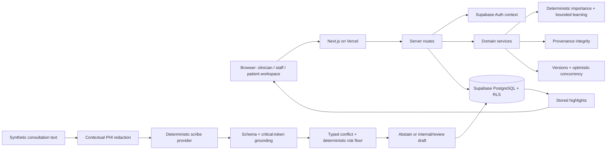
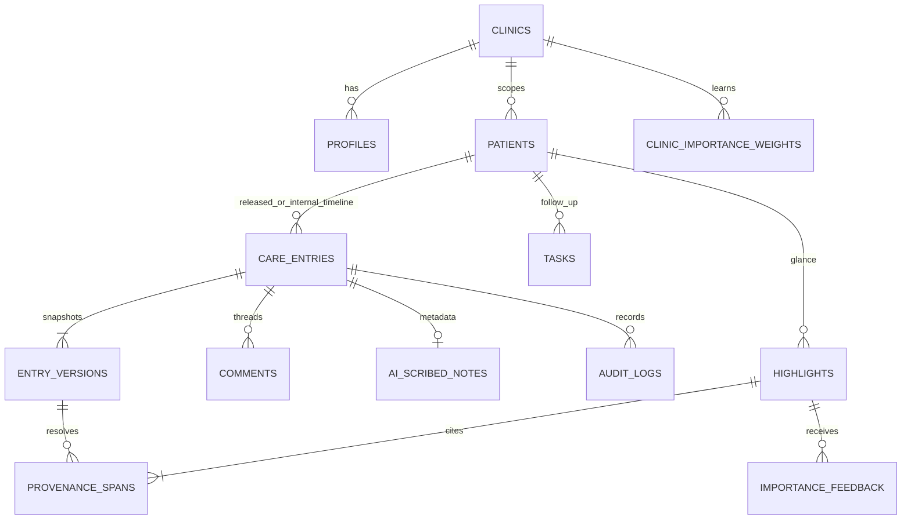

# Nightingale Care Note — Technical Brief

## 1. Problem framing

The core problem is not lack of patient information. It is the time and cognitive cost required to determine what matters now. EHRs preserve snapshots and notes, but a clinician still has to reconstruct the longitudinal story under consultation pressure.

AI can reduce reading, but reduction creates a verification problem: what if the model surfaces the wrong thing? Nightingale therefore treats reduction as reversible, prioritization as explainable, provenance as mandatory, and clinician judgment as authoritative.

## 2. Product response

**Glance → attention. Provenance → verification. Clinician confirmation → authority. Feedback → adaptation.**

Sarah Tan’s record compresses eighteen months into exactly three current priorities: worsening HbA1c, dizziness after a medication change, and an unresolved renal laboratory follow-up. Each item names its source and time, explains its deterministic rank, and can jump to an immutable source span. The earlier AI claim that Sarah stopped metformin remains visible as conflicted/superseded; the later clinician clarification takes authority without silently rewriting history.

## 3. Architecture



The warm Glance path reads stored structured highlights; opening a patient never invokes a provider. `POST /api/scribe` is the single real runtime path. The implemented `deterministic-clinical-v2` provider works without credentials; there is no live LLM or speech-to-text adapter in this build. Its output must pass schema validation, exact source-span and critical-token grounding, typed conflict detection, deterministic risk assignment, abstention, internal-only persistence, provenance, and audit.

## 4. Data model



`care_entries` is the shared timeline abstraction. Its `release_state` is `internal`, `review_required`, `approved`, or `released`, defaulting safely to `internal`. Content lives in immutable `entry_versions`; highlights cite a specific version and span. Revert creates a new version referencing its source. Audit logs contain actor, action, entity, timestamp, version transition, and safety-decision metadata, never note bodies.

## 5. Security and redaction

All displayed records are synthetic. Supabase Auth establishes identity; PostgreSQL RLS enforces patient, staff, clinician, admin, clinic, visibility, release, and author-ownership rules at the data layer. Patient care-entry SELECT requires the owned patient, `visibility = patient`, `release_state = released`, a non-AI entry type, and no AI Suggested, Conflict Detected, or Needs Review trust state. The application repeats this predicate as defense in depth. Patients remain denied internal comments, raw AI notes, audit data, and provenance that could reveal forbidden sources. Staff and clinicians cannot overwrite one another’s authored sections.

The provider flow is raw text → contextual known-name plus name/ID/phone/email/address/DOB redaction → deterministic provider → schema validation → critical-token grounding → conflict detection → deterministic risk floor → abstention → internal draft/provenance/audit. Ordinary capitalization is retained to limit false positives. The developer redaction drawer visibly compares the provider boundary before and after.

Provenance also fails closed on reads. Before a stored highlight is returned normally, the server requires an existing immutable version, valid bounds, an exact excerpt match, and a matching SHA-256 hash. Invalid claims are removed from the normal result and a deduplicated failure audit is attempted.

The role selector signs into a server-known synthetic Supabase Auth account using a server-only demo password. The browser never receives the Supabase secret key or password, and a client-supplied role is not trusted as authority.

## 6. Importance engine

Each candidate has score components for risk, unresolved action, recency, clinical change, conflict, and confirmation. Central weights produce a base score; a clinic/category multiplier produces the final score. The UI shows component-derived reasons, not an uncalibrated confidence percentage.

Feedback signals are Pin +3, Accept +2, Source Open +1, Dismiss −2, and Acknowledge 0. The exposure-aware update is:

```text
raw_delta = signal × 0.100 / max(4, prior_signal_count + 1)
applied_delta = 0 when raw_delta = 0, otherwise sign(raw_delta) × max(abs(raw_delta), 0.001)
multiplier = clamp(previous_multiplier + applied_delta, 0.80, 1.35)
```

Raw and applied deltas are audited. Critical or risk ≥ 0.9 safety-floor items cannot be dismissed; acknowledgement records review without changing ordering. Learning adapts workflow ordering, never clinical truth or deterministic safety risk.

## 7. Performance

`scripts/benchmark-glance.mjs` authenticates through the current Supabase session exchange, reuses the returned cookie, warms the QA-only `/api/highlights` path 15 times, then measures at least 100 successful requests. Every non-200 fails the run. On 27 Aug 2026, the local Next.js server against linked Supabase measured **P50 201.21 ms, P95 231.96 ms, P99 348.09 ms**, with 100/100 HTTP 200 responses. This includes the RLS-governed relational provenance read and server integrity verification; it excludes browser rendering.

## 8. Trade-offs and limitations

### What we deliberately did not build

- **CRDT collaboration:** section-level expected-version checks give deterministic 409 behavior and preserve independent edits.
- **Live voice capture:** the synthetic UI calls the real text safety pipeline for clinicians, but no microphone, transcription, or live LLM is implemented.
- **AI-only importance ranking:** rejected because ranking must remain explainable and testable.
- **Real patient/EHR integration:** excluded by the synthetic-data scope.
- **Arbitrary span comments:** entry-level threaded comments are complete; span precision is reserved for provenance.

PostgreSQL functions atomically create immutable versions, update current-version pointers, enforce expected-version checks, and write metadata-only audits. Feedback and learned weights persist per clinic. Older records use full, summary, or compressed display tiers; original source is retained, and active medications, diagnoses, allergies, and unresolved tasks never decay only because of age.

The public application is deployed at <https://nightingale-care-note.vercel.app>. Production validation uses the hidden `QA-0001` fixture for all mutations. The earlier D1/Sites implementation is preserved in Git history, while its obsolete runtime files and dependencies have been removed from the active tree.
