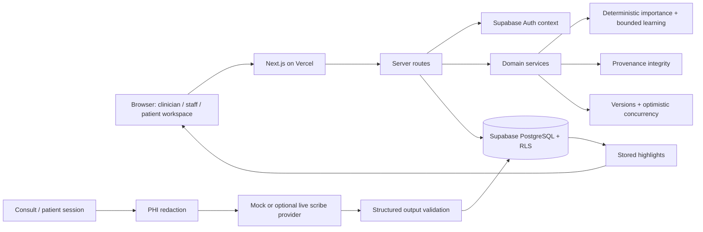

# Nightingale Care Note — Technical Brief

## 1. Problem framing

The core problem is not lack of patient information. It is the time and cognitive cost required to determine what matters now. EHRs preserve snapshots and notes, but a clinician still has to reconstruct the longitudinal story under consultation pressure.

AI can reduce reading, but reduction creates a verification problem: what if the model surfaces the wrong thing? Nightingale therefore treats reduction as reversible, prioritization as explainable, provenance as mandatory, and clinician judgment as authoritative.

## 2. Product response

**Glance → attention. Provenance → verification. Clinician confirmation → authority. Feedback → adaptation.**

Sarah Tan’s record compresses eighteen months into exactly three current priorities: worsening HbA1c, dizziness after a medication change, and an unresolved renal laboratory follow-up. Each item names its source and time, explains its deterministic rank, and can jump to an immutable source span. The earlier AI claim that Sarah stopped metformin remains visible as conflicted/superseded; the later clinician clarification takes authority without silently rewriting history.

## 3. Architecture

The warm Glance path reads stored structured highlights; opening a patient never synchronously invokes an LLM. The deterministic provider works with no credential. A live adapter must receive only redacted text and must pass structural validation before any care mutation.

## 4. Data model

`care_entries` is the shared timeline abstraction. Content lives in immutable `entry_versions`; highlights cite a specific version and span. Revert creates a new version referencing its source. Audit logs contain actor, action, entity, timestamp, and version transition only.

## 5. Security and redaction

All displayed records are synthetic. Supabase Auth establishes identity; PostgreSQL RLS enforces patient, staff, clinician, admin, clinic, visibility, and author-ownership rules at the data layer. Server-route checks supplement RLS. Patients are denied internal comments, raw AI notes, audit data, and provenance that could reveal forbidden sources. Staff and clinicians cannot overwrite one another’s authored sections.

The required provider flow is raw text → name/ID/phone/email/address/DOB redaction → provider → structured validation → care entry. The developer redaction drawer visibly compares the provider boundary before and after. Audit logs never contain note bodies.

The role selector signs into a server-known synthetic Supabase Auth account using a server-only demo password. The browser never receives the Supabase secret key or password, and a client-supplied role is not trusted as authority.

## 6. Importance engine

Each candidate has score components for risk, unresolved action, recency, clinical change, conflict, and confirmation. Central weights produce a base score; a clinic/category multiplier produces the final score. The UI shows component-derived reasons, not an uncalibrated confidence percentage.

Feedback signals are Pin +3, Accept +2, Source Open +1, and Dismiss −2. A signal changes the applicable clinic/category multiplier by `signal × 0.025`, clamped to 0.80–1.35. This makes adaptation visible and testable without letting clinic preference overwhelm clinical risk.

## 7. Performance

Measured locally on 25 Aug 2026 against the warm `/api/highlights` path, 100 sequential requests on Node v26.7.0 produced **P50 3.02 ms, P95 4.90 ms, P99 8.86 ms**. This measures the precomputed API path, not browser/network rendering and not a deployed-region result. The repeatable script is `scripts/benchmark-glance.mjs`.

## 8. Trade-offs and limitations

### What we deliberately did not build

- **CRDT collaboration:** section-level expected-version checks give deterministic 409 behavior and preserve independent edits.
- **Full voice capture:** architecture only; provenance, RBAC, and collaboration were higher-value proof points.
- **AI-only importance ranking:** rejected because ranking must remain explainable and testable.
- **Real patient/EHR integration:** excluded by the synthetic-data scope.
- **Arbitrary span comments:** entry-level threaded comments are complete; span precision is reserved for provenance.

PostgreSQL functions atomically create immutable versions, update current-version pointers, enforce expected-version checks, and write metadata-only audits. Feedback and learned weights persist per clinic. Older records use full, summary, or compressed display tiers; original source is retained, and active medications, diagnoses, allergies, and unresolved tasks never decay only because of age.

The public application is deployed at <https://nightingale-care-note.vercel.app>. On 26 Aug 2026, the complete 13-test suite passed against that deployment and the linked Supabase project, covering real Auth sessions, RLS isolation, patient visibility, persistence, revisions, deterministic conflicts, provenance, bounded learning, ranking, and redaction. The earlier D1/Sites implementation is preserved in Git history, while its obsolete runtime files and dependencies have been removed from the active tree.
