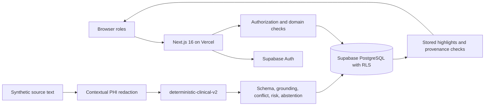
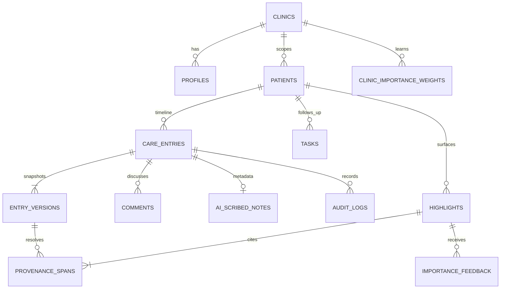

# Nightingale Care Note

## Technical Brief

## 1. Why I built it this way

During a consultation, a clinician may have months of notes to review. Lab results sit beside staff follow ups, patient messages, and earlier consult summaries. The useful detail is present, but finding what matters for today's visit takes time.

Nightingale Care Note gives the clinician a shorter starting point. It selects three current priorities, then keeps the supporting record close enough to inspect. The aim is to reduce reading time without asking the clinician to accept an AI summary on trust.

That decision shaped the rest of the implementation. Ranking is deterministic. Important claims retain exact source references. A clinician can confirm or reject ordinary suggestions. Earlier information stays in the record when a later entry corrects it.

## 2. The 10 second Glance

Sarah Tan is the main longitudinal example. Her clinician view shows three priorities from eighteen months of synthetic history. They cover dizziness after a medication change, worsening HbA1c, and a pending renal function follow up. Each card includes its time and source. The clinician can also open the reason for its position or jump to the evidence.

Risk and importance have different jobs in the ranking logic. Risk represents the safety severity of a finding if it is true. A Critical item, or an item with risk at least 0.9, receives a deterministic safety floor. It stays visible and cannot be dismissed.

Importance represents the amount of workflow attention an item needs now. Its base score uses risk, unresolved work, recency, clinical change, conflict, and clinician confirmation.

```text
base = 4*risk + 3*unresolved + 2*recency
     + 3*clinical_change + 2.5*conflict + 1*confirmation

workflow_importance = base * clinic_multiplier
final = max(deterministic_safety_floor, workflow_importance)
```

The clinic multiplier changes through explicit interactions. Pin contributes +3, Accept +2, Source Open +1, Dismiss -2, and Acknowledge 0. The database applies the following update using `prior_signal_count`.

```text
raw_delta = signal * 0.100 / max(4, prior_signal_count + 1)
applied_delta = 0 if raw_delta = 0
                otherwise sign(raw_delta) * max(abs(raw_delta), 0.001)
multiplier = clamp(previous + applied_delta, 0.80, 1.35)
```

Repeated feedback has less effect because the denominator grows with exposure. The 0.001 floor prevents a nonzero update from disappearing at database precision. Both the raw delta and the applied delta are audited. Learning changes ordinary workflow order only. It cannot change clinical truth or bypass the deterministic safety floor.

## 3. Evidence, grounding, and abstention

Every surfaced highlight points to a stored care entry and one immutable version of that entry. The provenance row also stores character offsets, the excerpt, and a SHA-256 hash. Before the API returns the highlight, it checks that the version exists. It then checks the offsets, exact text, and hash. If any check fails, the claim is withheld from the normal result.

Selecting **View evidence** scrolls to the matching timeline entry and marks the exact phrase for a short time. This lets an evaluator follow the claim back to the text that produced it.

The runtime keeps extraction separate from display wording.

```text
raw source -> structured assertion -> critical token grounding -> display or abstain
```

Grounding compares details that are risky to paraphrase incorrectly. It checks medication identity and status. It checks numbers, dose, units, frequency, and laboratory values. Polarity is checked as well, including negation. Allergy assertions also check the allergen and reaction.

An invalid source span causes abstention. The same happens when a critical token changes, such as 500 mg becoming 1000 mg. Assertions with too little semantic support are returned as insufficient evidence to surface confidently. A supported assertion that conflicts with an existing record enters Needs Review.

The interface does not show a model confidence percentage. The current provider has no calibrated probability that would justify one. Instead, the interface shows states that can be checked against system activity, such as AI Suggested, Clinician Confirmed, Clinician Rejected, Conflict Detected, Needs Review, and Superseded.

## 4. Conflict handling and patient release

Conflict detection covers three defined cases. It can find a change in allergy polarity, a disagreement about whether a medication is active, and a dosage or frequency mismatch. Comparisons work for AI and human entries as well as two human entries. The implementation does not claim to detect general medical contradictions.

When one of these conflicts is found, both assertions remain available with their sources. The draft is marked for review, and the patient release path stays blocked. A clinician must resolve the issue explicitly. Sarah's metformin example shows this in the timeline. The earlier AI statement is preserved while the later clinician clarification is treated as authoritative.

Care entries have one of four release states: `internal`, `review_required`, `approved`, or `released`. Patient access requires a record owned by that patient. The record must also have patient visibility and the `released` state. AI entry types are excluded. AI Suggested, Conflict Detected, and Needs Review trust states are excluded too.

These checks exist in the application query and in PostgreSQL Row-Level Security. Live tests confirm that a patient can read released patient safe content. They also confirm denial for another patient, internal records, raw AI notes, internal comments, and internal revision history.

## 5. Runtime AI path and PHI redaction

`POST /api/scribe` is the working runtime path. It first authenticates the Supabase session and checks the clinician's clinic scope. Raw text is redacted before provider processing. The response then passes schema validation and critical token grounding. Typed conflict checks and the risk floor run next. Assertions are divided into grounded, Needs Review, or withheld results before an internal draft is stored. Provenance and metadata only audit records are written with the draft.

The implemented provider is `deterministic-clinical-v2`. No external LLM is called in this build. A deterministic provider made it possible to repeat the same safety tests and demo results during the challenge. A future provider would still need to pass through the same redaction and validation boundaries.

Redaction tests cover known patient names and care team names. They include family names, titled names, and CJK names. Other fixtures cover Singapore style IDs, phone numbers, email, DOB, and multiline addresses. Structured JSON and key value text are tested too. The tests also check that useful clinical content remains, including medication names, dose, frequency, HbA1c, other laboratory values, and nonidentifying dates.

A missed identifier is a privacy failure. Removing genuine clinical detail is an accuracy failure. The evaluation checks both directions because aggressive replacement can damage the source used for grounding.

## 6. Architecture and stored data





Supabase Auth supplies the identity used by the server and database policies. The role selector signs in as a seeded synthetic user, so its browser label does not grant permission by itself. PostgreSQL RLS applies clinic scope, role rules, patient ownership, author restrictions, and the patient release rules described above.

Care entries use full immutable snapshots. Each successful edit increments the version number. A stale write to the same section returns `409 Conflict`. Reverting creates a new version that references the restored version, so later history is not deleted. Audit logs contain actor, action, entity, and version metadata. They do not contain note bodies.

## 7. Collaboration, Patient View, and Voice Capture

Clinicians and staff can add entry level comments, use mention text, and resolve or reopen comments. Task status is persistent. Treatment plan edits have diffs and revision history. Short lived Undo actions restore state through compensating writes. The task API accepts an owner change, although the current interface only exposes status. Reply fills a mention for a follow up comment instead of creating a nested reply tree.

Patient View uses simpler language and a smaller information set. It shows identity, the latest update, the next task, recent care, and the care team. Internal comments and raw AI notes are absent. The view also omits provenance controls, ranking details, and revision history. The family profile flow is a synthetic consent prototype stored only for the demo session.

Voice Capture demonstrates the intended review flow with patient specific fixtures. It includes ready, recording, paused, processing, and review states. A clinician can send the synthetic transcript text through `/api/scribe`, which creates an internal draft for hidden `QA-0001`.

The prototype does not access a microphone or upload audio. It has no speech to text, diarization, live LLM transcription, or production ambient listening. Patient capture is also a synthetic interface demonstration.

## 8. Performance, validation, and limits

The production benchmark signs in through `/api/session` and reuses the returned cookie. It performs 15 warmup requests, followed by 100 measured calls to `/api/highlights`. Any response outside the 200 range fails the run.

The production measurement on 28 Aug 2026 was **P50 207.60 ms, P95 268.50 ms, and P99 322.75 ms**. There were **0 failures**. The required target was P95 at or below 300 ms.

Validation reported 0 npm audit vulnerabilities. Lint and typecheck passed. The focused safety suite passed 23 of 23 tests. The live Supabase suite passed 17 of 17 tests, covering RLS and persistence. A production webpack build also passed. The default Turbopack build could not bind its helper port inside the audit sandbox, so webpack was used for the local production build check.

Several features were kept outside the challenge scope. There is no live LLM, real audio processing, generalized clinical NLP, CRDT editor, or EHR integration. The product uses only synthetic patient data. Arbitrary selected text comments were not built. The seed includes an AI doctor summary and an AI patient session, but it does not include an AI nurse consult summary.
