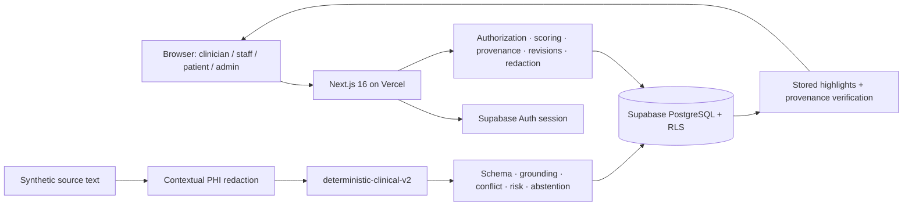
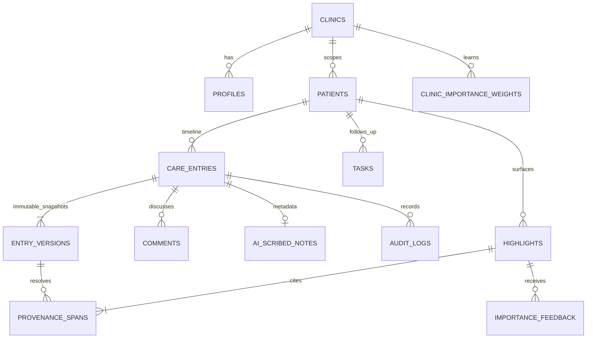

# Nightingale Care Note - Technical Brief

## 1. Problem and product thesis

The core problem is not lack of patient information. It is the time and cognitive cost required to determine what matters now. A clinician entering a consultation must reconstruct a story from dated notes, tasks, patient input, and structured snapshots.

AI can reduce that reading, but reduction creates a verification problem: what if the system surfaces the wrong thing? Nightingale's thesis is that clinical AI should reduce time-to-understanding without reducing the clinician's ability to verify, question, or override what it surfaces.

The product response is deliberately small: **Glance directs attention; provenance enables verification; clinician confirmation establishes authority; bounded feedback adapts workflow.** Reduction remains reversible, ranking remains explainable, and historical disagreement remains visible.

## 2. Ten-second Glance: risk is not importance

Sarah Tan's clinician workspace reduces eighteen months of synthetic history to exactly three priorities: dizziness after a medication change, worsening HbA1c, and a pending renal-function follow-up. Each item shows source/time, workflow actions, and an expandable explanation derived from actual score components.

Nightingale separates two concepts:

- **Risk** is safety severity if an assertion is true. A deterministic floor makes a Critical or risk ≥ 0.9 item remain surfaced and non-dismissible.
- **Importance** is what deserves workflow attention now. A transparent score combines risk, unresolved action, recency, clinical change, conflict, and confirmation, then applies a bounded clinic/category multiplier.

```text
base = 4·risk + 3·unresolved + 2·recency
     + 3·clinical_change + 2.5·conflict + 1·confirmation

workflow_importance = base × clinic_multiplier
final = max(deterministic_safety_floor, workflow_importance)
```

Feedback signals are Pin +3, Accept +2, Source Open +1, Dismiss -2, and Acknowledge 0. For `prior_signal_count`, the persistent database update is:

```text
raw_delta = signal × 0.100 / max(4, prior_signal_count + 1)
applied_delta = 0 if raw_delta = 0
                otherwise sign(raw_delta) × max(abs(raw_delta), 0.001)
multiplier = clamp(previous + applied_delta, 0.80, 1.35)
```

The denominator reduces leverage as exposure grows; the 0.001 precision floor keeps a non-zero update observable in storage. Raw and applied deltas are audited. **Learning adapts workflow ordering, never clinical truth or deterministic safety risk.**

## 3. Provenance, grounding, and abstention

Every highlight cites a care entry, immutable version, start/end offsets, stored excerpt, and SHA-256 source hash. Before returning a normal claim, the server verifies that the source/version exists, the bounds are valid, the exact slice equals the excerpt, and the hash matches. “View evidence” scrolls to the source entry and temporarily marks the exact phrase. No valid provenance means no normal surfaced AI claim.

The runtime distinguishes extraction from display:

```text
raw source → structured assertion → critical-token grounding → display wording
```

Grounding checks medication identity, numbers, dose, units, frequency, laboratory values, negation/polarity, allergen, reaction, and medication status. Exact-span failure or critical-token mismatch causes abstention; insufficient ordinary semantic overlap produces “Insufficient evidence to surface confidently.” A supported contradiction becomes Needs Review rather than a normal fact.

The interface does not show self-reported model confidence percentages. They would imply calibration that this prototype has not established. It shows verifiable workflow states instead: AI Suggested, Clinician Confirmed, Clinician Rejected, Conflict Detected, Needs Review, and Superseded.

## 4. Conflict and patient safety

Conflict detection is intentionally narrow and testable: allergy polarity, medication active/discontinued status, and medication dosage/frequency. It supports AI-human and human-human comparisons. Both assertions, both sources, and history are preserved; the draft enters review-required/Conflict state and needs explicit clinical resolution. This is not generalized medical contradiction detection.

Patient release is a separate safety boundary. `release_state` is `internal`, `review_required`, `approved`, or `released`. Patient access requires the owned patient, patient visibility, `released`, a non-AI entry type, and a trust state other than AI Suggested, Conflict Detected, or Needs Review. The application repeats the predicate, while PostgreSQL RLS remains authoritative. Tests deny another patient, internal records, raw AI notes, internal comments, and internal historical revisions while allowing released patient-safe content.

## 5. Runtime AI and redaction

`POST /api/scribe` performs authentication, clinic/role authorization, contextual PHI redaction, deterministic provider execution, schema validation, critical-token grounding, typed conflict detection, risk-floor application, abstention, internal persistence, provenance creation, and metadata-only audit.

The default and only implemented provider is `deterministic-clinical-v2`; no external LLM is called. The choice makes the safety path reproducible, testable, and demo-safe within the challenge. A live provider would remain behind the same pre-provider and post-provider controls.

Redaction occurs before provider processing. Evaluation covers known patient, clinician/staff, and family names; titled and CJK names; Singapore-style ID; phone; email; DOB; address/multiline address; structured JSON/key-value input; and combined PHI classes. Tests also ensure medication, dose, frequency, HbA1c/laboratory values, and non-identifying clinical dates remain intact. A false negative is a privacy failure; a false positive can remove clinically meaningful context and is therefore a clinical-accuracy failure.

## 6. Architecture and data model





Supabase Auth establishes real synthetic demo identities. PostgreSQL RLS enforces role, clinic, patient, release, and author boundaries; browser-selected role text is not authority. Full entry snapshots increase monotonically. Expected-version writes give deterministic `409 Conflict`; revert and clinical Undo create a new compensating version rather than deleting history. Audit logs contain actor/action/entity/version and safety metadata, never note bodies.

## 7. Collaboration, patient experience, and voice

Clinician/staff collaboration includes persistent entry-level comments, mention-prefilled replies, resolve/unresolve, task status, immutable treatment-plan versions, diffs, revert, and short-lived compensating Undo. The database/API supports task owner changes, but the present UI exposes status rather than reassignment. Replies are follow-up comments rather than nested parent/child threads.

Patient View is a distinct plain-language surface for identity, what to know, what to do next, current/recent care, and care-team context. It excludes internal morphology, provenance, comments, revisions, and ranking mechanics. The family profile is a synthetic, session-only consent prototype - not delegated hospital-account federation.

Voice Capture demonstrates ready, recording, paused, processing, and review states with current-patient fixtures. Clinician completion can send synthetic transcript text through the real `/api/scribe` path and persist only a hidden `QA-0001` internal draft. There is no microphone access, audio upload, STT, diarization, live LLM transcription, or production ambient listening.

## 8. Performance, validation, and trade-offs

The production benchmark signs in through `/api/session`, reuses the returned cookie, performs 15 warmups, then measures 100 authenticated `/api/highlights` calls; every non-200 fails the run. On 28 Aug 2026 it measured **P50 207.60 ms, P95 268.50 ms, P99 322.75 ms, 0 failures**. P95 meets the required ≤ 300 ms target.

Final validation: npm audit 0 vulnerabilities; lint and typecheck pass; 23/23 focused safety tests pass; 17/17 live Supabase/RLS/persistence tests pass; and the production webpack build succeeds. The default Turbopack build cannot bind its helper port inside this audit sandbox, a tooling restriction rather than an application compile failure.

Deliberate exclusions are a live LLM, real audio/STT, generalized clinical NLP, CRDT editing, arbitrary span comments, EHR/FHIR integration, and real patient data. The seeded demo contains AI doctor and AI patient-session notes but no AI nurse-consult summary. These trade-offs keep the evaluated trust path narrow enough to prove rather than broad enough to imply unsupported safety.
